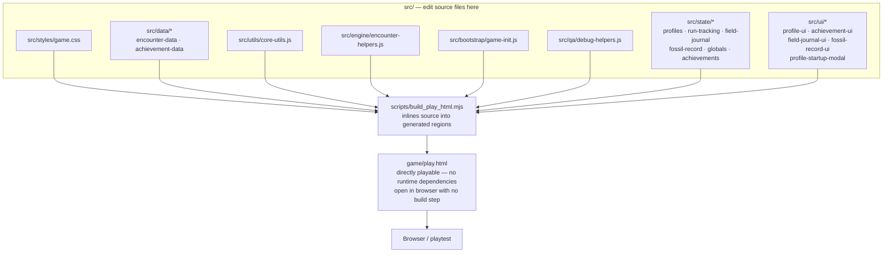
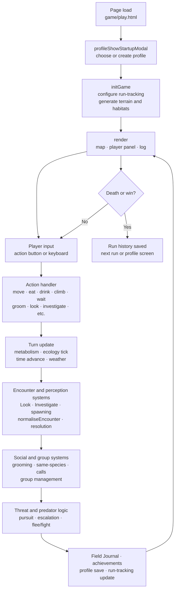

# Evolution Game

A browser-based survival and evolution simulation about surviving as an early primate-like creature in a dynamic prehistoric ecosystem.

The current build is a single-file HTML prototype: no install, server, account, build tools, or package manager required. The design aim is not just a simple roguelike, but a living ecological sandbox where movement, habitat, height, weather, water, visibility, hunger, hydration, group behaviour, and animal encounters all interact.

The project is in an early rapid-iteration phase. Current work is focused on making the ecosystem richer and more testable while keeping the playable build stable.

---

## Play now

Stable public play link:

`https://gy8s.github.io/evolution-game/`

That root link redirects to:

`game/play.html`

`game/play.html` is the stable filename intended for playtesting and phone shortcuts. Versioned HTML files are kept so the underlying build history remains traceable.

> **Playtesting tip:** Open the HTML file or GitHub Pages link directly in your browser. Do not use embedded browser previews inside ChatGPT or similar tools; they can slow down or crash the tab.

---

## Current playable build

| Field      | Value                                          |
|------------|------------------------------------------------|
| Version    | v66.57                                         |
| Patch area | Early ecology expansion / Patch 8 short ecological cycles |
| Build ID   | `v66.57_patch8_short_eco_cycles_2026-04-29`    |
| Stable file | `game/play.html`                             |
| Versioned file | `game/evolution_game_v66_57.html`         |
| SHA256     | `0d7a7ff8ab4791076c06614923dfdf5e873d51f80a1c16cb41c5bab39ba78193` |

Patch 8 is not the whole project direction. It is one part of a broader first-pass ecology upgrade: making habitats, encounters, hazards, and short-term environmental changes feel more alive and less static.

---

## Project vision

The game should feel like an immersive prehistoric survival sim where the player is small, vulnerable, observant, and embedded in an ecosystem.

Core design goals:

- **Ecological richness:** the world should feel busy, layered, and reactive rather than a sequence of isolated random encounters.
- **Readable risk:** danger should often be hinted through tracks, sounds, movement, weather, smell, group reactions, or partial sightings rather than announced plainly.
- **Meaningful movement:** ground, undergrowth, mid-storey, and canopy movement should carry different opportunities and risks.
- **Survival pressure:** hunger, hydration, injury, poison, predation, weather, and exhaustion should all matter.
- **Player learning:** the player should gradually learn which foods, animals, habitats, and behaviours are safe or dangerous.
- **Replayability:** repeated playthroughs should create different stories through changing encounters, weather, ecology cycles, and animal behaviour.
- **Traceable development:** every change should be reviewable, tested where practical, and recorded clearly.

---

## Current gameplay systems

The prototype currently centres on:

- Tile-based world movement.
- Multiple vertical layers: ground, undergrowth, mid-storey, canopy.
- Fitness, energy, size, hydration, and related survival pressures.
- Food, water, poison, carcass, insect, nest, and plant interactions.
- Predator/prey encounters and escalating danger.
- Weather and habitat-driven encounter variation.
- Short ecological cycles such as fruiting pulses, insect blooms, dry spells, wet spells, scavenger pulses, predator lulls, and predator spikes.
- Group/social behaviour in early form.
- Lineage progression along a concrete taxon route (Purgatorius → Teilhardina → Notharctus → Eosimias): the player starts as Purgatorius and unlocks the next representative lineage stage by reaching adulthood and mating 3 times, then chooses whether to evolve now, keep exploring, or evolve on death. Encounter tables and world generation are not yet stage-specific.
- Debug tools and bot testing tools for QA.

These systems are still evolving. Many are deliberately lightweight at this stage so they can be tested and expanded without making the codebase unmanageable.

---

## Repository layout

```text
evolution-game/
├── README.md                         Project overview and workflow
├── CHANGELOG.txt                     Reverse-chronological change record
├── CLAUDE.md                         Operating rules for AI assistants
├── AI_REVIEW_DIALOGUE.txt            GPT/Claude review coordination notes
├── manifest.json                     PWA/home-screen metadata
├── index.html                        GitHub Pages entry point; redirects to game/play.html
├── icon.png                          Source app icon
├── icon-192.png                      PWA icon
├── icon-512.png                      PWA icon
├── game/
│   ├── play.html                     Stable playable build used by public link/PWA
│   └── evolution_game_v66_57.html    Versioned playable build
├── src/
│   ├── bootstrap/
│   │   └── game-init.js              Game bootstrap source (inlined into play.html by the build script)
│   ├── engine/
│   │   └── encounter-helpers.js      Encounter helper functions source (inlined into play.html by the build script)
│   ├── qa/
│   │   └── debug-helpers.js          Debug/QA helper functions source (inlined into play.html by the build script)
│   ├── styles/
│   │   └── game.css                  CSS source (inlined into play.html by the build script)
│   ├── data/
│   │   ├── encounter-data.js         Encounter + spawn-table source (inlined into play.html by the build script)
│   │   └── achievement-data.js       Achievement definitions source (inlined into play.html by the build script)
│   ├── utils/
│   │   └── core-utils.js             Pure utility helpers source (inlined into play.html by the build script)
│   ├── ui/
│   │   ├── achievement-ui.js         Achievement UI/support source (inlined into play.html by the build script)
│   │   ├── field-journal-ui.js       Field Journal UI helpers source (inlined into play.html by the build script)
│   │   ├── fossil-record-ui.js       Fossil Record display helpers source (inlined into play.html by the build script)
│   │   ├── profile-startup-modal.js  Profile selection/startup modal source (inlined into play.html by the build script)
│   │   └── profile-ui.js             Profile/win-modal UI helpers source (inlined into play.html by the build script)
│   └── state/
│       ├── game-state-globals.js     Global constant/state declarations source (inlined into play.html by the build script)
│       ├── run-tracking.js           Run-tracking state factory source (inlined into play.html by the build script)
│       ├── profile-storage-constants.js  Profile/storage constant declarations (inlined into play.html by the build script)
│       ├── profile-factories.js      Profile factory/helper functions source (inlined into play.html by the build script)
│       ├── profile-store-core.js     Profile store core helpers source (inlined into play.html by the build script)
│       ├── profile-state-snapshot.js Profile state capture/restore helpers source (inlined into play.html by the build script)
│       ├── profile-run-lifecycle.js  Profile run summary/lifecycle helpers source (inlined into play.html by the build script)
│       ├── achievement-persistence.js Achievement persistence helpers source (inlined into play.html by the build script)
│       ├── field-journal-state.js    Field Journal state/persistence helpers source (inlined into play.html by the build script)
│       ├── fossil-record-state.js    Fossil Record persistence helper source (inlined into play.html by the build script)
│       ├── profile-delete.js         Profile deletion helper source (inlined into play.html by the build script)
│       └── run-tracking-update.js    Run-tracking update function source (inlined into play.html by the build script)
├── docs/
│   ├── current-game-structure.md     How the game works now: systems, flows, line ranges
│   ├── documentation-map.md          What each doc covers and when to update it
│   ├── architecture-notes.md         Internal file layout and do-not-touch warnings
│   ├── bug-guardrails.md             Known repeated failure modes and prevention checks
│   ├── project-plan.md               Non-code design plan, priorities, and idea log
│   ├── release-checklist.md          Step-by-step checklist for each release
│   ├── design-decisions.md           Record of significant design choices
│   ├── testing-protocol.md           QA and bot testing guidance
│   └── patch8-short-eco-cycles.txt   Detailed notes for Patch 8 ecology cycle work
├── logs/
│   ├── bot-runs/                     Raw bot run outputs when intentionally saved
│   └── consolidated/                 AI-reviewed summaries and bug reports
├── scripts/
│   ├── build_play_html.mjs           Inlines src/ source files into game/play.html
│   ├── check_html_js_syntax.mjs      JavaScript syntax checker for game HTML files
│   └── ingest_bot_report.sh          Helper for manually ingesting downloaded bot logs
└── .github/
    └── pull_request_template.md      Required PR checklist
```

---

## Controlled rebuild plan

The game has grown to ~18,400 lines in a single HTML file. It still works, but the structure is now too fragile to maintain safely. The plan is to restructure it in three phases while keeping the playable build stable throughout.

**Phase 1 — Documentation repair and source/build scaffold** *(complete)*  
Repair all documentation. Create `docs/current-game-structure.md` and `docs/documentation-map.md`. Extract pure helpers and data into `src/` files with a build scaffold that inlines them back into `game/play.html`. Make documentation checks mandatory in every PR. **Phase 1 is now complete** — see Phase 1 status table below.

**Phase 2 — Deeper extraction and architecture plan** *(requires George's explicit approval before starting)*  
Agree a proposed modular structure before any further code is moved. Phase 2 candidates are listed in `docs/project-plan.md`. No Phase 2 extraction begins until George approves.

**Phase 3 — Safe extraction** *(after Phase 2 is approved)*  
Extract remaining systems in small PRs in a defined order, keeping the playable build working at every step.

The rebuild is not a rewrite, not a framework migration, and not a gameplay redesign. See `docs/project-plan.md` for full detail.

### Build scaffold

Twenty-four source extractions are complete:

| Source file | What it contains | Destination in play.html |
|-------------|-----------------|--------------------------|
| `src/styles/game.css` | All CSS | Inline `<style>` block |
| `src/data/encounter-data.js` | `encounters`, `encounterTables`, `hiddenSubtypePools` | Two JS regions (~line 1040 and ~line 6069) |
| `src/utils/core-utils.js` | Pure stateless helper functions | One JS region (~line 5853) |
| `src/data/achievement-data.js` | `ACHIEVEMENT_DEFS` (definitions only; persistence stays in play.html) | One JS region (~line 4810) |
| `src/state/run-tracking.js` | `freshRunTracking()` (factory only; save/profile logic stays in play.html) | One JS region (~line 4773) |
| `src/state/profile-storage-constants.js` | Profile/storage key constants (7 `const` declarations; all profile logic stays in play.html) | One JS region (~line 4481) |
| `src/state/profile-factories.js` | Profile factory/helper functions (`profileGenerateId`, `profileEmptyStore`, `profileDefaultStats`; all other profile logic stays in play.html) | One JS region (~line 4500) |
| `src/state/profile-store-core.js` | Profile store core helpers (`profileLoadStore`, `profileSaveStore`, `profileCreateNew`, `profileGetActive`, `profileCheckBuildCompatibility`; all other profile logic stays in play.html) | One JS region (~line 4514) |
| `src/state/profile-state-snapshot.js` | Profile active-run capture/restore helpers (`profileCaptureWorldArrays`, `profileCaptureState`, `profileRestoreState`; all other profile logic stays in play.html) | One JS region (~line 4579) |
| `src/state/profile-run-lifecycle.js` | Profile run summary/lifecycle helpers (`profileKnowledgeCount`, `profileBuildRunSummary`, `profileRunIsGodMode`, `profileUpdateStats`, `profileOnRunEnd`, `profileSaveActiveRun`, `profileStartNewRun`, `profileResumeActiveRun`; all other profile logic stays in play.html) | Three JS regions (~line 4720, ~line 5013, ~line 5152) |
| `src/state/achievement-persistence.js` | Achievement persistence helpers (`loadAchievements`, `saveAchievements`, `awardAchievement`, `checkAchievements`; `getProfileAchievements`, toast system, `renderAchievements`, `updateRunTracking` stay in play.html) | Three JS regions (~line 4877, ~line 4901, ~line 4946) |
| `src/state/field-journal-state.js` | Field Journal state/persistence helpers (`profileLoadFieldJournal`, `profileWriteJournalEntry`, `getEncounterLogCategory`, `journalMarkFirstSeen`; Field Journal rendering stays in play.html) | One JS region (~line 5107) |
| `src/ui/achievement-ui.js` | Achievement UI/support (`getProfileAchievements`, `_toastQueue`, `_toastActive`, `clearToastQueue`, `showAchievementToast`, `_processToastQueue`, `renderAchievements`) | Three JS regions (~line 4896, ~line 4919, ~line 4968) |
| `src/state/run-tracking-update.js` | Run-tracking update (`updateRunTracking`) | One JS region (~line 4999) |
| `src/ui/profile-ui.js` | Profile/win-modal UI helpers (`showWinModal`, `hideWinModal`, `onWinAchieved`, `profileUpdatePanelUI`) | Two JS regions (~line 5222, ~line 5246) |
| `src/ui/field-journal-ui.js` | Field Journal UI helpers (`showEncounterJournalEntry`, `showFieldJournal`) | One JS region (~line 12946) |
| `src/state/fossil-record-state.js` | Fossil Record persistence (`saveFossilRecord`) | One JS region (~line 14311) |
| `src/ui/fossil-record-ui.js` | Fossil Record display helpers (`renderFossilRecord`, `renderRunRecap`) | One JS region (~line 14330) |
| `src/state/profile-delete.js` | Profile deletion helper (`deleteProfile`) | One JS region (~line 5280) |
| `src/ui/profile-startup-modal.js` | Profile selection/startup modal (`profileShowStartupModal`) | One JS region (~line 5311) |
| `src/bootstrap/game-init.js` | Game bootstrap (`initGame`) | One JS region (~line 5441) |
| `src/state/game-state-globals.js` | Global constants and state declarations (`KNOWLEDGE_*`, `KNOWLEDGE_TIERS`, `socialGroup`, `playerSpeciesProfile`, `environment`, `timeState`, `layerNarration`, etc.) | Two JS regions (~line 5472 and ~line 5741) |
| `src/qa/debug-helpers.js` | Debug/QA helper functions (`addDebugTrace`, `debugRoll`, `importantStateSnapshot`, `diffSnapshots`, `takeQABackSnapshot`, `restoreQABackSnapshot`, `addTurnDeltaTrace`, `addDebugFlag`, `scanForSuspiciousState`) | One JS region (~line 5514) |
| `src/engine/encounter-helpers.js` | Encounter helper functions (`getEncounterTemplate`, `validateEncounterData`, `normaliseEncounter`) | One JS region (~line 5792) |

`game/play.html` keeps all content **inline** so it stays directly playable with no build step or runtime dependency. To regenerate `game/play.html` after editing any source file:

```sh
node scripts/build_play_html.mjs
```

The script replaces only the marked generated regions; it never touches code outside those regions. **Edit source in `src/`; do not hand-edit the generated regions in `game/play.html`.**

### Build scaffold flowchart



This is an **inline build scaffold**, not a module system. `game/play.html` is the playable artifact at every step. Generated regions inside `game/play.html` should not be hand-edited; edit the corresponding `src/` file and run the build script.

### Runtime flowchart



All systems shown run inside `game/play.html`. Extracted source files (`src/`) contribute helpers and data inlined at build time; none run independently.

### Phase 1 status

Phase 1 is complete. The table below shows what was extracted and what remains in `game/play.html`.

| Category | Status | Location |
|----------|--------|----------|
| CSS | Extracted | `src/styles/game.css` |
| Encounter data | Extracted | `src/data/encounter-data.js` |
| Achievement data | Extracted | `src/data/achievement-data.js` |
| Utility helpers | Extracted | `src/utils/core-utils.js` |
| Game bootstrap (`initGame`) | Extracted | `src/bootstrap/game-init.js` |
| Encounter helpers | Extracted | `src/engine/encounter-helpers.js` |
| Global state declarations | Extracted | `src/state/game-state-globals.js` |
| Run-tracking factory | Extracted | `src/state/run-tracking.js` |
| Profile/save (constants, factories, core, snapshot, lifecycle) | Extracted | `src/state/profile-*.js` |
| Achievement persistence | Extracted | `src/state/achievement-persistence.js` |
| Run-tracking update | Extracted | `src/state/run-tracking-update.js` |
| Field Journal state | Extracted | `src/state/field-journal-state.js` |
| Fossil Record state | Extracted | `src/state/fossil-record-state.js` |
| Profile delete | Extracted | `src/state/profile-delete.js` |
| Debug/QA helpers | Extracted | `src/qa/debug-helpers.js` |
| Achievement UI | Extracted | `src/ui/achievement-ui.js` |
| Profile UI / win modal | Extracted | `src/ui/profile-ui.js` |
| Field Journal UI | Extracted | `src/ui/field-journal-ui.js` |
| Fossil Record UI | Extracted | `src/ui/fossil-record-ui.js` |
| Profile startup modal | Extracted | `src/ui/profile-startup-modal.js` |
| World generation | Remaining | `game/play.html` — Phase 2 candidate |
| Turn engine | Remaining | `game/play.html` — Phase 2 candidate |
| Look / Investigate | Remaining | `game/play.html` — Phase 2 candidate |
| Encounter spawning / resolution | Remaining | `game/play.html` — Phase 2 candidate |
| Social / group systems | Remaining | `game/play.html` — Phase 2 candidate |
| Predator / pursuit logic | Remaining | `game/play.html` — Phase 2 candidate |
| Action handlers | Remaining | `game/play.html` — Phase 2 candidate |
| Rendering / map / input | Remaining | `game/play.html` — Phase 2 candidate |
| Bot runner | Remaining | `game/play.html` — Phase 2 candidate |

**Phase 2 requires George's explicit approval before any further extraction begins.** Phase 2 candidates and rationale are in `docs/project-plan.md`.

---

## Project planning documents

Use `docs/project-plan.md` for non-code planning.

That document is for:

- future feature ideas,
- design direction,
- priority decisions,
- open questions,
- technical/development principles,
- futureproofing notes,
- things discussed with GPT or Claude that should not be lost in chat history.

It should not contain implementation code. It is a planning and alignment document so George, GPT, and Claude can reason from the same set of goals before choosing the next patch.

---

## Bot testing and QA evidence

The game includes bot/debug tooling to help find regressions and odd behaviours.

The intended evidence flow is:

1. Run bot tests in the playable build.
2. Save compact and/or full logs where needed.
3. Store raw bot evidence under `logs/bot-runs/` when intentionally retained.
4. Review logs with GPT and/or Claude.
5. Write a higher-level report under `logs/consolidated/`.
6. Turn confirmed issues into focused patch requests.
7. Delete or avoid committing unnecessarily large raw files once they have served their purpose.

Compact logs are preferred for routine review. Full logs should be kept for deep dives or serious failures because they can become large.

---

## Bug guardrails and repeated-error prevention

Known serious or repeated errors are recorded in `docs/bug-guardrails.md`.

Before a PR is treated as ready, the author and reviewer should check whether any existing guardrail applies. If a new serious bug is found, the fix should include either:

- a new guardrail entry, or
- an update to an existing guardrail.

Current active guardrails include:

- JavaScript syntax errors that stop the full game from initialising.
- Missed changelog entries after repo/code changes.

---

## Development workflow

- **`main` is the stable, playable version.** It should always contain a working build that can be opened and played immediately.
- **Use branches and pull requests for changes.** Changes should be made on a separate branch and proposed through a PR wherever practical.
- **George merges the pull request** only after review confirms the change is correct and limited to what was intended.
- **The other assistant reviews the PR in plain English** before merge where possible, confirming what changed, what did not change, and what still needs checking.
- **Pull requests must clearly state scope:** gameplay logic, UI/layout, bot/debug tools, app loading/PWA files, documentation/workflow, or other.
- **Keep patches small and focused.** One purpose per branch. Do not bundle unrelated changes.
- **Every PR must address `CHANGELOG.txt`.** If the changelog is not updated, the PR must explain why.
- **Every serious bug fix should consider `docs/bug-guardrails.md`.** Repeated mistakes should become documented guardrails.
- **Do not claim tests were run unless they were actually run.** Say clearly when something is static review only.

---

## Mandatory smoke checks for playable-build changes

Any change touching `game/*.html`, `index.html`, `manifest.json`, bot/debug tools, or app-loading behaviour must address the render/syntax safety checklist in `.github/pull_request_template.md`.

Minimum expectation:

- JavaScript syntax check, once available.
- Open `game/play.html` in a browser.
- Confirm the game is not blank or half-loaded.
- Confirm the map appears.
- Confirm player/status UI appears.
- Confirm core action controls appear.
- Take at least one action/turn.
- Check the browser console for red JavaScript errors.

This exists because a single JavaScript syntax error in the large HTML file can prevent the entire game script from loading.

---

## Changelog policy

`CHANGELOG.txt` is the human-readable history of the project. It should be updated for changes to:

- gameplay logic,
- UI/layout,
- bot/debug/QA tools,
- app-loading/PWA files,
- documentation/workflow,
- repository structure.

Entries should be plain English and should state what changed, who made the change, and whether gameplay/UI/bot/app-loading/documentation were affected.

---

## Notes for GPT and Claude

When working on this repository:

- Read the README, `CHANGELOG.txt`, `.github/pull_request_template.md`, and `docs/bug-guardrails.md` before preparing a PR.
- Check `docs/project-plan.md` when deciding priorities or interpreting design direction.
- Keep owner-facing summaries plain English.
- Do not silently broaden scope.
- Do not describe a PR as complete or safe unless changelog and guardrail status are addressed.
- Prefer small, reviewable changes over large speculative rewrites.
