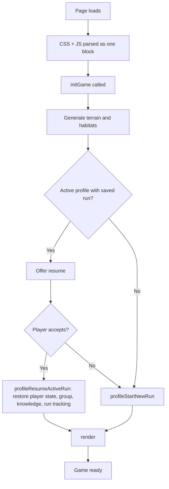
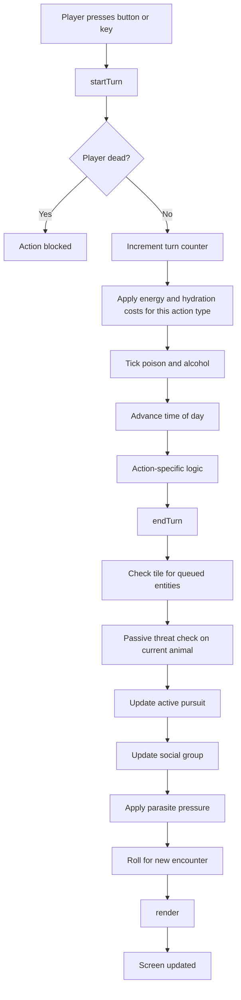
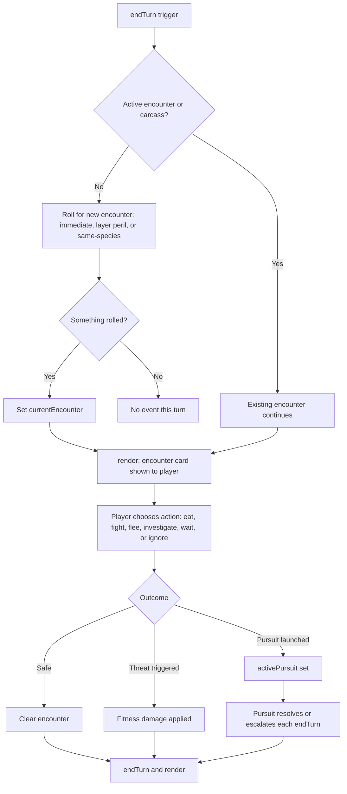
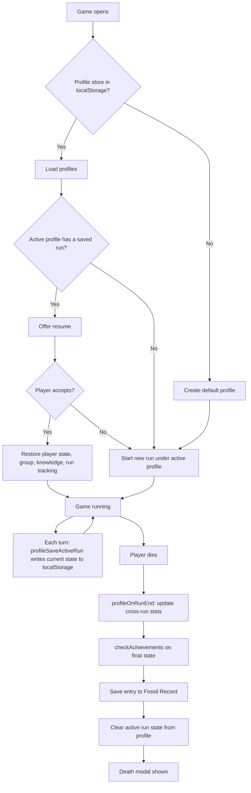
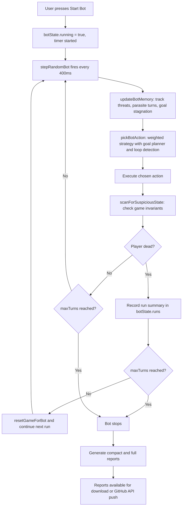
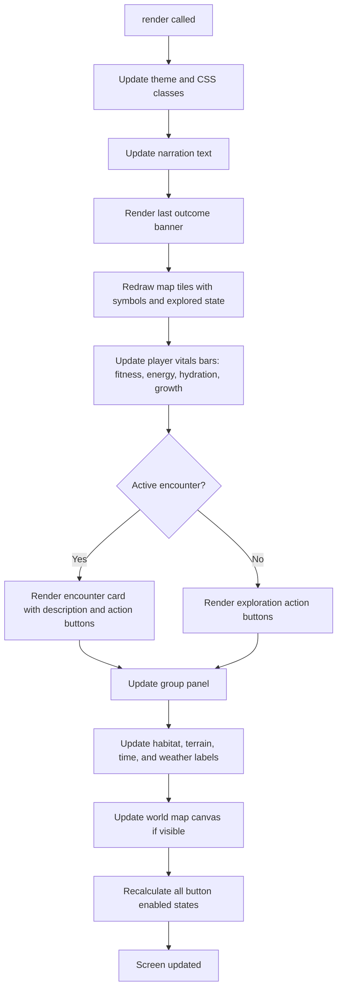

# Current Game Structure

This document describes what the game is, how it works, and what lives where in the codebase. It is the primary reference for understanding the current build before any architectural changes are made.

Last updated: 2026-06-05 (Phase 1 complete — 24 source extractions done; build scaffold and architecture flowcharts added to README.md; Phase 2 candidates listed in docs/project-plan.md).

---

## What the game is

Evolution Game is a browser-based single-player survival simulation. The player controls a small early primate navigating a procedurally generated prehistoric forest. The goal is to survive, explore, eat, drink, avoid predators, and learn about the world.

The game runs from a single HTML file (`game/play.html`, ~18,400 lines). There is no bundler and no server. Open the file in a browser and it works.

Twenty-four source extractions are complete. The playable file `game/play.html` still contains all content inline (between marker comments) so it works with no build step or runtime dependency.

| Source file | What it contains | In play.html |
|-------------|-----------------|--------------|
| `src/styles/game.css` | All CSS | Inline `<style>` block |
| `src/data/encounter-data.js` | `encounters`, `encounterTables`, `hiddenSubtypePools` | Two inline JS regions |
| `src/utils/core-utils.js` | Pure stateless helpers (clamp, roll, choice, clonePlain, escapeHtml, chooseWeighted, text-sanitisation helpers) | One inline JS region (~line 5853) |
| `src/data/achievement-data.js` | `ACHIEVEMENT_DEFS` (definitions array only) | One inline JS region (~line 4810) |
| `src/state/run-tracking.js` | `freshRunTracking()` factory (run-tracking schema only) | One inline JS region (~line 4773) |
| `src/state/profile-storage-constants.js` | Profile/storage key constants (7 `const` declarations) | One inline JS region (~line 4481) |
| `src/state/profile-factories.js` | Profile factory helpers (`profileGenerateId`, `profileEmptyStore`, `profileDefaultStats`) | One inline JS region (~line 4500) |
| `src/state/profile-store-core.js` | Profile store core helpers (`profileLoadStore`, `profileSaveStore`, `profileCreateNew`, `profileGetActive`, `profileCheckBuildCompatibility`) | One inline JS region (~line 4514) |
| `src/state/profile-state-snapshot.js` | Profile active-run capture/restore helpers (`profileCaptureWorldArrays`, `profileCaptureState`, `profileRestoreState`) | One inline JS region (~line 4579) |
| `src/state/profile-run-lifecycle.js` | Profile run summary/lifecycle helpers (`profileKnowledgeCount`, `profileBuildRunSummary`, `profileRunIsGodMode`, `profileUpdateStats`, `profileOnRunEnd`, `profileSaveActiveRun`, `profileStartNewRun`, `profileResumeActiveRun`) | Three inline JS regions (~line 4720, ~line 5013, ~line 5152) |
| `src/state/achievement-persistence.js` | Achievement persistence helpers (`loadAchievements`, `saveAchievements`, `awardAchievement`, `checkAchievements`) | Three inline JS regions (~line 4877, ~line 4901, ~line 4946) |
| `src/state/field-journal-state.js` | Field Journal state/persistence helpers (`profileLoadFieldJournal`, `profileWriteJournalEntry`, `getEncounterLogCategory`, `journalMarkFirstSeen`) | One inline JS region (~line 5107) |
| `src/ui/achievement-ui.js` | Achievement UI/support (`getProfileAchievements`, `_toastQueue`, `_toastActive`, `clearToastQueue`, `showAchievementToast`, `_processToastQueue`, `renderAchievements`) | Three inline JS regions (~line 4896, ~line 4919, ~line 4968) |
| `src/state/run-tracking-update.js` | Run-tracking update function (`updateRunTracking`) | One inline JS region (~line 4999) |
| `src/ui/profile-ui.js` | Profile/win-modal UI helpers (`showWinModal`, `hideWinModal`, `onWinAchieved`, `profileUpdatePanelUI`) | Two inline JS regions (~line 5222, ~line 5246) |
| `src/ui/field-journal-ui.js` | Field Journal UI helpers (`showEncounterJournalEntry`, `showFieldJournal`) | One inline JS region (~line 12946) |
| `src/state/fossil-record-state.js` | Fossil Record persistence (`saveFossilRecord`) | One inline JS region (~line 14311) |
| `src/ui/fossil-record-ui.js` | Fossil Record display helpers (`renderFossilRecord`, `renderRunRecap`) | One inline JS region (~line 14330) |
| `src/state/profile-delete.js` | Profile deletion helper (`deleteProfile`) | One inline JS region (~line 5280) |
| `src/ui/profile-startup-modal.js` | Profile selection/startup modal (`profileShowStartupModal`) | One inline JS region (~line 5311) |
| `src/bootstrap/game-init.js` | Game bootstrap (`initGame`) | One inline JS region (~line 5441) |
| `src/state/game-state-globals.js` | Global constants and state declarations (`KNOWLEDGE_*`, `KNOWLEDGE_TIERS`, `socialGroup`, `noiseLevel`, `playerSpeciesProfile`, `environment`, `timeState`, `timePhaseDurations`, `windOptions`, `weatherOptions`, `layerNarration`) | Two inline JS regions (~line 5472 and ~line 5741) |
| `src/qa/debug-helpers.js` | Debug/QA helper functions (`addDebugTrace`, `debugRoll`, `importantStateSnapshot`, `diffSnapshots`, `takeQABackSnapshot`, `restoreQABackSnapshot`, `addTurnDeltaTrace`, `addDebugFlag`, `scanForSuspiciousState`) | One inline JS region (~line 5514) |
| `src/engine/encounter-helpers.js` | Encounter helper functions (`getEncounterTemplate`, `validateEncounterData`, `normaliseEncounter`) | One inline JS region (~line 5792) |

`scripts/build_play_html.mjs` inlines all source files back into `game/play.html`. Only configuration-like declarations and simple factory/helper functions are extracted — `profileCaptureWorldArrays`, `profileCaptureState`, `profileRestoreState`, `profileUpdateStats`, `profileOnRunEnd`, active-run logic, save/load logic, and all other game code remain inside `game/play.html`. All JavaScript engine code and HTML structure also remain inside `game/play.html` for now.

---

## How the game starts

When the page loads, the browser parses the HTML, loads all CSS and JavaScript in one block, then calls `initGame()`. If an active profile has a saved run, the player is offered a resume. Otherwise a new run begins under the active profile.

---

## Turn flow

Every player action follows the same three-step pattern: **startTurn → action logic → endTurn → render**.

`startTurn()` applies metabolic costs, advances time of day, ticks poison and alcohol, and checks for death. If the player is already dead it returns false and the action is cancelled.

`endTurn()` processes the consequences: tile checks, passive threat reactions, pursuit updates, group and parasite updates, noise events, and fresh encounter rolls. It always ends with `render()`.

---

## Survival needs

The player has four survival stats tracked each turn:

| Stat | What it measures | Consequence if neglected |
|------|-----------------|--------------------------|
| Fitness | Physical health and injury | Reaches zero → death |
| Energy | Fuel for action | Zero energy drains fitness over time |
| Hydration | Water level | Low hydration adds energy penalty; zero drains fitness each turn |
| Growth progress | Accumulated growth conditions met | Fills when energy ≥ 75 and hydration ≥ 45; size increases when full |

Each action has a metabolic profile (energy and hydration cost). High-exertion actions (climbing, fleeing) burn more; passive actions (waiting, grooming) burn less.

---

## Encounter lifecycle

Encounters are the main interactive events. They can be animals, plants, carcasses, nests, or environmental hazards. Most encounters arrive at the end of a turn via `endTurn()` and remain until the player resolves them.

Encounters have a `dangerProfile` (`safe`, `nuisance`, `risky`, `predator`, `fatal`, `venomous_ambush`, `grapple`). Resolution logic uses this alongside the player's current state, group size, layer, and the encounter's `temperament`. Persistence type determines how long an encounter stays on the tile: `ephemeral` (animals that may leave), `lingering` (ambush predators), or `static` (forageables, nests, carcasses).

---

## Poison system

Poison is a separate state on the player (`player.poison`). It has a rank (1–3), a source key, and a remaining duration. Each call to `startTurn()` ticks the poison, applying fitness damage per turn. Higher ranks do more damage. The player can have an active encounter AND active poison simultaneously. Past poison exposures are stored in `player.poisonHistory`.

---

## Profiles and save system

The game supports multiple named profiles. All data is stored in `localStorage` under versioned keys. There is no server-side save.

Each profile stores:
- Cross-run stats (best turn count, total runs, total matings, etc.)
- Field Journal knowledge accumulated across all runs
- Achievements (50 definitions, stored as unlocked/date pairs)
- Fossil Record entries (last 10 runs: turns, cause of death, companions, date)
- Active run state (restorable if the tab is closed mid-run)

---

## Field Journal

The Field Journal is the player's accumulated knowledge database. It is opened via a button and shows five tabs: **Plants & fungi**, **Animals**, **Fruit & berries**, **Fossils**, and **Awards**.

Knowledge accumulates across runs. Investigating an encounter increases the knowledge level for that encounter type (0–30, six tiers: unknown → noticed → familiar → understood → expert → natural-historian). Higher levels unlock natural-history text, behaviour notes, and gameplay tips. Knowledge is stored per profile and persists across runs.

---

## Fossil Record

The Fossil Record stores the last 10 run outcomes: turns survived, cause of death, companion count, date, and profile ID. It is accessible from the Field Journal's Fossils tab at any time during a run, and is briefly summarised on the death screen. Entries are tagged with a profile ID; deleting a profile removes its entries.

---

## Achievements

There are 50 achievement definitions across 8 categories (Survival, Foraging, Exploration, Social, Danger, Growth, Milestones). Achievements are checked every turn, on death, and when a run ends. When unlocked, a toast notification appears. Achievements are stored per profile and shown in the Field Journal's Awards tab.

---

## Group and social system

The player can recruit same-species companions (`socialGroup.members`). The group has cohesion (drops under stress), shared food/water history, and a loss counter. Group members improve threat detection and can occasionally intercept predator attacks. Social encounters with the same species can trigger socialisation prompts leading to group membership.

---

## Ecology and world state

The global `environment` object covers:
- Current weather (clear, rain, storm, heat, wildfire, etc.)
- Wind direction (affects scent detection)
- Time of day (dawn, day, dusk, night — affects encounter rates and visibility)
- Short ecological cycles (fruiting pulse, insect bloom, dry spell, wet spell, scavenger pulse, predator lull, predator spike)

`worldTick()` advances cycles each turn and can change weather and cycle state. These affect which encounters spawn and how dangerous they are.

---

## Bot and QA tooling

The bot (`botState`) runs the game automatically for QA purposes. It uses a weighted strategy (survival-driven: seeks food/water when needed, avoids known threats, flees pursuit) and records every step.

Reports come in two formats:
- **Compact** — QA issues, death-cause rollup, run summary table, patch gate summary. Use for routine review.
- **Full** — everything above plus per-step snapshots and raw JSON. Use only for deep debugging.

The bot can push reports directly to GitHub via the API using a fine-grained PAT stored in `sessionStorage` (cleared when the tab closes).

---

## Render lifecycle

All visual updates go through a single `render()` call. It redraws the full UI from current state every time it runs — there is no virtual DOM or reactive framework.

`render()` is always the last call in `endTurn()`. It is also called directly after profile modals, encounter resolution, and bot steps.

---

## What lives in game/play.html (approximate line ranges)

| Lines | Area |
|-------|------|
| 1–990 | HTML head, inline CSS (generated — source is `src/styles/game.css`), HTML body structure (UI panels, buttons, modals) |
| 990–1020 | Game version constant |
| 1021–3501 | Static data: encounter definitions + spawn tables — generated, source is `src/data/encounter-data.js` [1/2] |
| 3631–4252 | World generation: terrain, habitats, altitude, water, clay deposits |
| 4253–4478 | Player state object and dynamic world state (waterState, socialGroup, nearbyEntities) |
| 4479–4489 | Profile/storage constants — generated, source is `src/state/profile-storage-constants.js` |
| 4491–4499 | Profile state variables (currentProfileId, currentRunId, runGodModeUsed, etc.) |
| 4500–4512 | Profile factory helpers — generated, source is `src/state/profile-factories.js` |
| 4514–4577 | Profile store core helpers — generated, source is `src/state/profile-store-core.js` |
| 4579–4718 | Profile state snapshot helpers — generated, source is `src/state/profile-state-snapshot.js` |
| 4720–4771 | Profile run lifecycle [1/3] (profileKnowledgeCount, profileBuildRunSummary, profileRunIsGodMode, profileUpdateStats) — generated, source is `src/state/profile-run-lifecycle.js` |
| 4773–4804 | Run-tracking state factory (`freshRunTracking`) — generated, source is `src/state/run-tracking.js` |
| 4810–4875 | Achievement definitions (`ACHIEVEMENT_DEFS`, 50 defs) — generated, source is `src/data/achievement-data.js` |
| 4877–4894 | Achievement persistence [1/3] (loadAchievements, saveAchievements) — generated, source is `src/state/achievement-persistence.js` |
| 4896–4901 | Achievement UI [1/3] (getProfileAchievements) — generated, source is `src/ui/achievement-ui.js` |
| 4903–4917 | Achievement persistence [2/3] (awardAchievement) — generated, source is `src/state/achievement-persistence.js` |
| 4919–4948 | Achievement UI [2/3] (toast queue/helpers) — generated, source is `src/ui/achievement-ui.js` |
| 4950–4966 | Achievement persistence [3/3] (checkAchievements) — generated, source is `src/state/achievement-persistence.js` |
| 4968–4997 | Achievement UI [3/3] (renderAchievements) — generated, source is `src/ui/achievement-ui.js` |
| 4999–5025 | Run-tracking update — generated, source is `src/state/run-tracking-update.js` |
| 5013–5099 | Profile run lifecycle [2/3] (profileOnRunEnd, profileSaveActiveRun) — generated, source is `src/state/profile-run-lifecycle.js` |
| 5107–5158 | Field Journal state/persistence helpers — generated, source is `src/state/field-journal-state.js` |
| 5160–5210 | Profile run lifecycle [3/3] (profileStartNewRun, profileResumeActiveRun) — generated, source is `src/state/profile-run-lifecycle.js` |
| 5222–5242 | Profile UI [1/2] (showWinModal, hideWinModal, onWinAchieved) — generated, source is `src/ui/profile-ui.js` |
| 5246–5278 | Profile UI [2/2] (profileUpdatePanelUI) — generated, source is `src/ui/profile-ui.js` |
| 5280–5307 | Profile delete — generated, source is `src/state/profile-delete.js` |
| 5311–5437 | Profile startup modal — generated, source is `src/ui/profile-startup-modal.js` |
| 5441–5469 | Game bootstrap (`initGame`) — generated, source is `src/bootstrap/game-init.js` |
| 5472–5512 | Game state globals [1/2] (knowledge constants, socialGroup, playerSpeciesProfile) — generated, source is `src/state/game-state-globals.js` |
| 5514–5741 | Debug/QA helper functions — generated, source is `src/qa/debug-helpers.js` |
| 5741–5787 | Game state globals [2/2] (environment, timeState, layerNarration, etc.) — generated, source is `src/state/game-state-globals.js` |
| 5792–5881 | Encounter helper functions — generated, source is `src/engine/encounter-helpers.js`: getEncounterTemplate, validateEncounterData, normaliseEncounter |
| 12946–13068 | Field Journal UI — generated, source is `src/ui/field-journal-ui.js`: showEncounterJournalEntry, showFieldJournal |
| 14311–14325 | Fossil Record state — generated, source is `src/state/fossil-record-state.js`: saveFossilRecord |
| 14330–14381 | Fossil Record UI — generated, source is `src/ui/fossil-record-ui.js`: renderFossilRecord, renderRunRecap |
| 5853–5942 | Core utilities — generated, source is `src/utils/core-utils.js`: pure helpers (clamp, roll, choice, clonePlain, escapeHtml, etc.) |
| 5943–6068 | Remaining utilities: logging, debug helpers, narration setters |
| 6069–6147 | hiddenSubtypePools — generated, source is `src/data/encounter-data.js` [2/2] |
| 6148–7646 | Remaining utilities, turn flow: startTurn, endTurn, metabolism, ecology tick |
| 7645–8461 | Nearby entity simulation: spawning, persistence, world registry |
| 8462–11359 | Social system, same-species encounters, group management, calls |
| 11360–11858 | Threat and predator logic: pursuit, escalation, flee/fight resolution |
| 11859–12555 | Player action handlers: move, eat, drink, climb, wait, groom, look, etc. |
| 12556–14503 | Investigation system, carcass interactions, encounter resolution helpers, Field Journal render |
| 14504–15871 | Bot/QA: botState, strategy, step execution, goal planner, loop detection |
| 15872–16719 | Debug helpers: compact/full report generation, GitHub API push, debug downloads |
| 16720–17172 | Rendering helpers: encounter card HTML builder, button state logic |
| 17173–18466 | Main render function, event listeners, game initialisation call, tag extension pass |

---

## Known fragile areas

- **Any syntax error in the `<script>` block breaks the entire game.** The browser cannot run the script at all if parsing fails. Run `node scripts/check_html_js_syntax.mjs` before every game-file PR.
- **`game/play.html` and `game/evolution_game_v66_57.html` must be kept in sync** on each release. If one is edited, both must be updated.
- **The bot auto-save uses the GitHub API directly from the browser.** It requires a fine-grained PAT stored in `sessionStorage`; it clears when the tab closes.
- **The encounter resolution area** (~11328–12523) is tightly coupled. Changes there can break survival balance in non-obvious ways.
- **The `render()` function** is called very frequently. Missing a call or adding an unexpected recursive call causes visible glitches.
- **`player.knowledge` / `player.classKnowledge`** accumulate across runs and feed the Field Journal. Incorrect resets at run boundaries lose journal data permanently.

---

## What will eventually become modular

The rebuild plan (see `docs/project-plan.md`) targets extraction in this rough order:

1. CSS and HTML templates — **CSS extracted to `src/styles/game.css`** ✓; HTML templates still inline
2. Static encounter data and spawn tables — **`encounters`, `encounterTables`, `hiddenSubtypePools` extracted to `src/data/encounter-data.js`** ✓
3. Pure helper functions with no side effects — **pure stateless helpers extracted to `src/utils/core-utils.js`** ✓
4. State and save schema (player object, world state, profile schema)
5. Turn engine (startTurn, endTurn, encounter resolution)
6. Rendering layer
7. Bot/QA tools

### Build scaffold

`scripts/build_play_html.mjs` inlines all source files back into `game/play.html`:

| Source | Markers in play.html |
|--------|---------------------|
| `src/styles/game.css` | `/* BEGIN/END GENERATED CSS: src/styles/game.css */` inside `<style>` |
| `src/data/encounter-data.js` [1/2] | `// BEGIN/END GENERATED JS: src/data/encounter-data.js [1/2]` |
| `src/data/encounter-data.js` [2/2] | `// BEGIN/END GENERATED JS: src/data/encounter-data.js [2/2]` |
| `src/utils/core-utils.js` | `// BEGIN/END GENERATED JS: src/utils/core-utils.js` |
| `src/data/achievement-data.js` | `// BEGIN/END GENERATED JS: src/data/achievement-data.js` |
| `src/state/run-tracking.js` | `// BEGIN/END GENERATED JS: src/state/run-tracking.js` |
| `src/state/profile-storage-constants.js` | `// BEGIN/END GENERATED JS: src/state/profile-storage-constants.js` |
| `src/state/profile-factories.js` | `// BEGIN/END GENERATED JS: src/state/profile-factories.js` |
| `src/state/profile-store-core.js` | `// BEGIN/END GENERATED JS: src/state/profile-store-core.js` |
| `src/state/profile-state-snapshot.js` | `// BEGIN/END GENERATED JS: src/state/profile-state-snapshot.js` |
| `src/state/profile-run-lifecycle.js` [1/3] | `// BEGIN/END GENERATED JS: src/state/profile-run-lifecycle.js [1/3]` |
| `src/state/profile-run-lifecycle.js` [2/3] | `// BEGIN/END GENERATED JS: src/state/profile-run-lifecycle.js [2/3]` |
| `src/state/profile-run-lifecycle.js` [3/3] | `// BEGIN/END GENERATED JS: src/state/profile-run-lifecycle.js [3/3]` |
| `src/state/achievement-persistence.js` [1/3] | `// BEGIN/END GENERATED JS: src/state/achievement-persistence.js [1/3]` |
| `src/state/achievement-persistence.js` [2/3] | `// BEGIN/END GENERATED JS: src/state/achievement-persistence.js [2/3]` |
| `src/state/achievement-persistence.js` [3/3] | `// BEGIN/END GENERATED JS: src/state/achievement-persistence.js [3/3]` |
| `src/state/field-journal-state.js` | `// BEGIN/END GENERATED JS: src/state/field-journal-state.js` |
| `src/ui/achievement-ui.js` [1/3] | `// BEGIN/END GENERATED JS: src/ui/achievement-ui.js [1/3]` |
| `src/ui/achievement-ui.js` [2/3] | `// BEGIN/END GENERATED JS: src/ui/achievement-ui.js [2/3]` |
| `src/ui/achievement-ui.js` [3/3] | `// BEGIN/END GENERATED JS: src/ui/achievement-ui.js [3/3]` |
| `src/state/run-tracking-update.js` | `// BEGIN/END GENERATED JS: src/state/run-tracking-update.js` |
| `src/ui/profile-ui.js` [1/2] | `// BEGIN/END GENERATED JS: src/ui/profile-ui.js [1/2]` |
| `src/ui/profile-ui.js` [2/2] | `// BEGIN/END GENERATED JS: src/ui/profile-ui.js [2/2]` |
| `src/ui/field-journal-ui.js` | `// BEGIN/END GENERATED JS: src/ui/field-journal-ui.js` |
| `src/state/fossil-record-state.js` | `// BEGIN/END GENERATED JS: src/state/fossil-record-state.js` |
| `src/ui/fossil-record-ui.js` | `// BEGIN/END GENERATED JS: src/ui/fossil-record-ui.js` |
| `src/state/profile-delete.js` | `// BEGIN/END GENERATED JS: src/state/profile-delete.js` |
| `src/ui/profile-startup-modal.js` | `// BEGIN/END GENERATED JS: src/ui/profile-startup-modal.js` |
| `src/bootstrap/game-init.js` | `// BEGIN/END GENERATED JS: src/bootstrap/game-init.js` |
| `src/state/game-state-globals.js` [1/2] | `// BEGIN/END GENERATED JS: src/state/game-state-globals.js [1/2]` |
| `src/qa/debug-helpers.js` | `// BEGIN/END GENERATED JS: src/qa/debug-helpers.js` |
| `src/state/game-state-globals.js` [2/2] | `// BEGIN/END GENERATED JS: src/state/game-state-globals.js [2/2]` |
| `src/engine/encounter-helpers.js` | `// BEGIN/END GENERATED JS: src/engine/encounter-helpers.js` |

The source file `src/data/encounter-data.js` contains a `// << SPLIT: hiddenSubtypePools >>` line dividing part 1 from part 2. `src/state/profile-run-lifecycle.js` contains two split lines (`// << SPLIT: profileOnRunEnd >>` and `// << SPLIT: profileStartNewRun >>`) dividing it into three parts. `src/state/achievement-persistence.js` contains two split lines (`// << SPLIT: awardAchievement >>` and `// << SPLIT: checkAchievements >>`) dividing it into three parts. `src/ui/achievement-ui.js` contains two split lines (`// << SPLIT: toastHelpers >>` and `// << SPLIT: renderAchievements >>`) dividing it into three parts, because the achievement-persistence [2/3] and [3/3] generated regions sit between the target groups in `play.html`. `src/ui/profile-ui.js` contains one split line (`// << SPLIT: profileUpdatePanelUI >>`) dividing it into two parts, because the `// ===== PROFILE PANEL UI =====` banner comment sits between the two groups in `play.html`. `src/state/game-state-globals.js` contains one split line (`// << SPLIT: environmentState >>`) dividing it into two parts, because debug/QA function declarations sit between the two declaration clusters in `play.html`. All other source files — including `src/ui/field-journal-ui.js`, `src/state/fossil-record-state.js`, `src/ui/fossil-record-ui.js`, `src/state/profile-delete.js`, `src/ui/profile-startup-modal.js`, `src/bootstrap/game-init.js`, `src/qa/debug-helpers.js`, and `src/engine/encounter-helpers.js` — have no split marker and each maps to one contiguous region.

Run `node scripts/build_play_html.mjs` after editing any source file. Do not hand-edit generated regions in `game/play.html`. This document will be updated as each further extraction completes.
